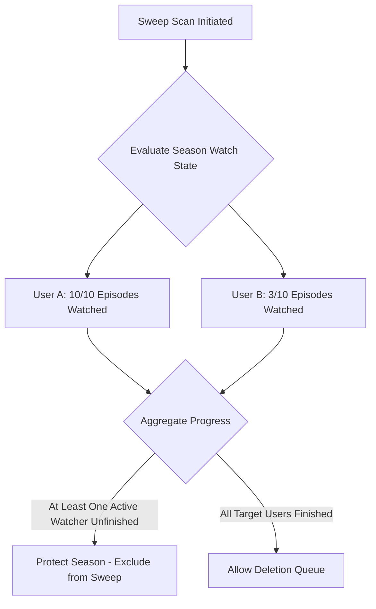

# Multi-User Synchronization & Safety

To prevent deleting media that one user has finished but another user is actively watching, Sweeprr uses a robust, multi-user watch state aggregation system.

## Aggregation Logic

Before any file is flagged for deletion, `WatchAggregationService` aggregates watch status across the server. 
- For **Movies**, it checks the played status.
- For **TV Shows**, it aggregates watch progress at the **season and episode level**. A season is only marked as "watched" if all episodes within it are watched.

---

## User Scopes

Administrators can configure the user scope per **Rule Group** using three distinct policies:

1. **All Users (Default)**: Media is only marked as watched if *every* active user on the Jellyfin server has watched it.
2. **Whitelist**: Watch progress is aggregated only for a specified subset of users. Perfect for household setups where only the main watchers' states matter.
3. **Exclude**: Watch progress is aggregated for all users *except* specific service or guest accounts.

---

## The Partial Watching Protection

If User A has completed a season but User B is only on Episode 3, the media remains **protected** in the Arr and will not be swept.

---

## Crucial Safety Guards

- **Pessimistic Matching**: If a user's watch history cannot be retrieved due to a network glitch (transient failure), the item is **excluded** from the scan. Sweeprr defaults to assuming the item is active.
- **Empty Scope**: If a whitelist is set but contains zero valid users, it matches nothing (no sweeps will be executed) to protect files from total erasure.
